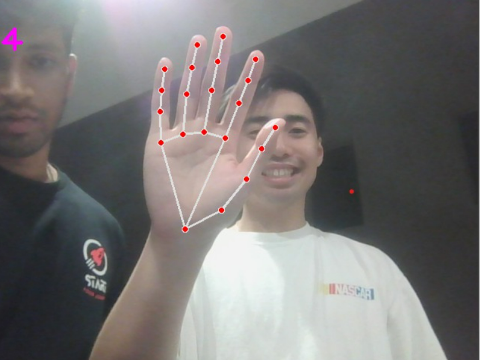

# Hand Pose Estimation and Space Invaders Unity Game

## In this twist to the classic space invaders game, instead of using buttons to play, you can use hand movements to dodge and attack aliens! Get ready for an out-of-this-world interactive experience!

### Technologies used: Python, C#, Unity, MediaPipe library, OpenCV
#### 1st Place Challenge Winner for Crew Entertainment Systems at the NASA Johnson Space Center Hackathon 2023
(https://www.youtube.com/watch?v=N2SoNtVLAh8)

